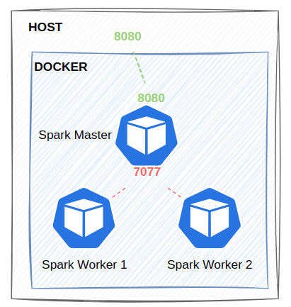

# Overvew
Real-time data from **Kafka** is processed with **Spark Structured Streaming** and stored in **PostgreSQL**, leveraging *dimensional modeling* to optimize performance for **business intelligence queries**.


<br>*Spark cluster deployed using Docker, consisting of one master node and two worker nodes.*

**Source Data Schema:**

| Name         | Data Type | Description                                          | Example                                                                                                                                                              |
|--------------|-------|------------------------------------------------------|----------------------------------------------------------------------------------------------------------------------------------------------------------------------|
| id           | String | Log ID                                               | aea4b823-c5c6-485e-8b3b-6182a7c4ecce                                                                                                                               |
| api_version  | String | API version                                          | 1.0                                                                                                                                                                |
| collection   | String | Log type                                             | view_product_detail                                                                                                                                                |
| current_url  | String | URL of the webpage the user is visiting             | https://www.glamira.cl/glamira-anillo-saphira-skug100335.html?alloy=white-375&diamond=sapphire&stone2=diamond-Brillant&itm_source=recommendation&itm_medium=sorting |
| device_id    | String | Device ID                                            | 874db849-68a6-4e99-bcac-fb6334d0ec80                                                                                                                               |
| email        | String | User's email address                                 |                                                                                                                                                                    |
| ip           | String | IP address                                           | 190.163.166.122                                                                                                                                                    |
| local_time   | String | Time the log was created. Format: yyyy-MM-dd HH:mm:ss | 2024-05-28 08:31:22                                                                                                                                                |
| option       | Array | List of product options                            | `[{"option_id": "328026", "option_label": "diamond"}]`                                                                                                             |
| product_id   | String | Product ID                                           | 96672                                                                                                                                                              |
| referrer_url | String | Webpage URL leading to `current_url`                | https://www.google.com/                                                                                                                                            |
| store_id     | String | Store ID                                             | 85                                                                                                                                                                 |
| time_stamp   | Long  | Timestamp of when the log record was created         |                                                                                                                                                                    |
| user_agent   | String | Browser and device information                       | Mozilla/5.0 (iPhone; CPU iPhone OS 13_4_1 like Mac OS X) AppleWebKit/605.1.15 (KHTML, like Gecko) Version/13.1 Mobile/15E148 Safari/604.1                          |

# 1. Dim Model

## 1.1. fact_event
| Column        | Type     |
|---------------|----------|
| `id`          | `text`   |
| `time_stamp`  | `bigint` |
| `ip`          | `text`   |
| `device_id`   | `text`   |
| `api_version` | `text`   |
| `store_id`    | `text`   |
| `local_time`  | `text`   |
| `current_url` | `text`   |
| `referrer_url`| `text`   |
| `email`       | `text`   |
| `collection`  | `text`   |
| `product_id`  | `text`   |
| `option`      | `text`   |
| `browser_key` | `text`   |
| `os_key`      | `text`   |
| `tld`         | `text`   |
| `date_key`    | `date`   |

## 1.2. dim_tld
| Column        | Type   |
|---------------|--------|
| `tld`         | `text` |
| `country_name`| `text` |

## 1.3. dim_os
| Column     | Type   |
|------------|--------|
| `os_key`   | `text` |
| `os_family`| `text` |
| `os_version`| `text` |

## 1.4. dim_date
| Column               | Type    |
|----------------------|---------|
| `date_key`           | `date`  |
| `full_date`          | `text`  |
| `day_of_week`        | `text`  |
| `day_of_week_short`  | `text`  |
| `year_month`         | `text`  |
| `month`              | `text`  |
| `year`               | `text`  |
| `year_number`        | `integer`|
| `is_weekday_or_weekend`| `text`  |

## 1.5. dim_browser
| Column          | Type   |
|-----------------|--------|
| `browser_key`   | `text` |
| `browser_family`| `text` |
| `browser_version`| `text` |

# 2. Run Command
```shell
run_spark.sh
```
